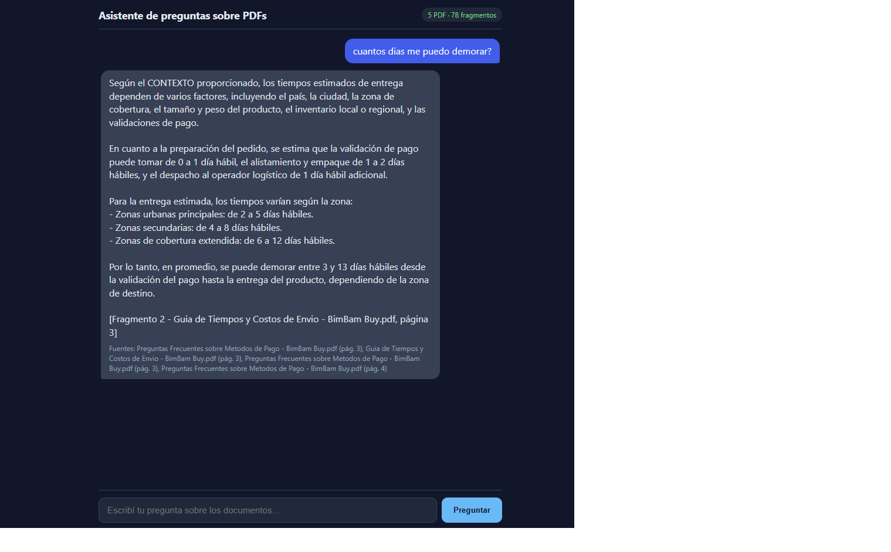
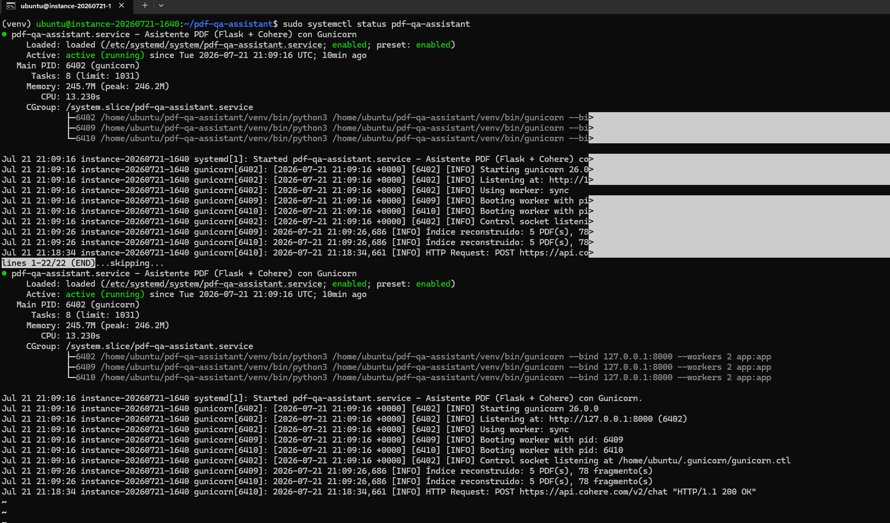

# Asistente de preguntas y respuestas sobre PDFs — Challenge Alura Agente

## Descripción general

Agente de inteligencia artificial que responde preguntas en lenguaje natural
basándose **únicamente** en el contenido de documentos PDF propios, sin usar
conocimiento externo ni inventar información. Implementa un patrón de
**RAG (Retrieval-Augmented Generation)**: primero recupera los fragmentos de
texto más relevantes para la pregunta y luego los usa como contexto para que
un modelo de lenguaje (Cohere) genere la respuesta, citando siempre el
documento y la página de origen.

Caso de uso elegido: documentación de atención al cliente de **BimBam Buy**
(e-commerce), incluyendo política de reembolsos y devoluciones, programa de
afiliados, guía de tiempos y costos de envío, preguntas frecuentes sobre
métodos de pago, y manual de garantía de productos.

## Arquitectura de la solución

```
PDFs (documents/)
      │
      ▼
pdf_loader.py ──► extrae texto por página con pypdf
      │
      ▼
text_index.py ──► trocea el texto en fragmentos solapados
      │            y construye un índice TF-IDF (scikit-learn)
      ▼
[usuario hace una pregunta desde la interfaz web]
      │
      ▼
text_index.py ──► busca los fragmentos más relevantes
      │            por similitud coseno
      ▼
cohere_client.py ──► arma un prompt con esos fragmentos como
      │               contexto + system prompt estricto
      ▼
API de Cohere (Chat) ──► genera la respuesta anclada al contexto
      │
      ▼
app.py (Flask) ──► expone la respuesta vía API REST y la
                    muestra en la interfaz de chat
```

El diseño separa cada responsabilidad en su propio módulo: extracción
(`pdf_loader.py`), recuperación/indexado (`text_index.py`), generación
(`cohere_client.py`) y la capa web (`app.py` + `templates/` + `static/`).
Usar TF-IDF para la recuperación evita depender de un servicio externo de
embeddings, manteniendo la solución simple y sin costo adicional.

## Tecnologías y herramientas

- **Python 3.10+**
- **Flask** — servidor web y API REST
- **pypdf** — extracción de texto de archivos PDF
- **scikit-learn** — vectorización TF-IDF y similitud coseno para la
  recuperación de fragmentos relevantes (retrieval)
- **Cohere API** (endpoint Chat v2, modelo `command-r-08-2024`) — generación
  de respuestas ancladas al contexto recuperado
- **HTML / CSS / JavaScript** (vanilla) — interfaz de chat responsive
- **gunicorn**, **nginx**, **systemd** — despliegue en producción
- **Oracle Cloud Infrastructure (OCI)** — hosting de la aplicación

## Instrucciones para ejecutar

### Instalación local

```bash
python3 -m venv venv
source venv/bin/activate        # Windows: venv\Scripts\activate
pip install -r requirements.txt
cp .env.example .env            # Windows: copy .env.example .env
```

Editá `.env` y completá `COHERE_API_KEY` (se obtiene gratis en
[dashboard.cohere.com/api-keys](https://dashboard.cohere.com/api-keys)).

### Uso

1. Copiá tus PDFs a la carpeta `documents/`.
2. Corré el servidor:
   ```bash
   python app.py
   ```
3. Abrí `http://127.0.0.1:5000` en el navegador.

Si agregás PDFs con el servidor corriendo, llamá a `POST /api/reload` o
reiniciá la app para reindexar.

### API

| Endpoint       | Método | Descripción                                     |
| -------------- | ------ | ------------------------------------------------ |
| `/`            | GET    | Interfaz de chat                                  |
| `/api/ask`     | POST   | `{"question": "..."}` → `{"answer", "sources"}`   |
| `/api/reload`  | POST   | Reindexa los PDFs de `documents/`                 |
| `/api/status`  | GET    | Cantidad de documentos y fragmentos indexados     |

## Ejemplos de preguntas y respuestas

**Pregunta:** ¿cuántos días tengo para pedir devolución por retracto?

**Respuesta del agente:**
> Según el fragmento 1 del documento Política de Reembolsos y Devoluciones -
> BimBam Buy.pdf, página 4, tienes 10 días corridos posteriores a la
> recepción del pedido para solicitar la devolución por retracto.

**Pregunta:** ¿Cuánto tiempo tarda en llegar un pedido y qué pasa si se
atrasa?

**Respuesta del agente:**
> [...] en el documento Guía de Tiempos y Costos de Envío - BimBam Buy.pdf,
> página 8, se mencionan ejemplos operativos [...] un pedido en una ciudad
> principal se entrega en 3 días hábiles con envío estándar sin incidencia
> [...] En cuanto a las posibles demoras, se mencionan factores que pueden
> afectar el tiempo de tránsito, como la reprogramación, retorno a bodega o
> incidencia logística. Se recomienda mantener un seguimiento activo y
> comunicar al cliente el estado actual y el tiempo estimado de entrega.

En ambos casos el agente cita el documento y la página exactos de donde
extrajo la información, y evita responder con datos que no estén respaldados
por los PDFs cargados.

## Estructura del proyecto

| Archivo/carpeta        | Rol                                                |
| ----------------------- | --------------------------------------------------- |
| `app.py`                | Servidor Flask y rutas de la API                     |
| `pdf_loader.py`         | Extracción de texto con pypdf                        |
| `text_index.py`         | Troceado y búsqueda TF-IDF de fragmentos             |
| `cohere_client.py`      | Llamada a Cohere con system prompt estricto          |
| `templates/index.html`  | Interfaz de chat                                     |
| `static/`               | CSS y JS de la interfaz                              |
| `documents/`            | PDFs a indexar (no se versionan)                     |
| `requirements.txt`      | Dependencias                                         |
| `.env.example`          | Plantilla de variables de entorno                    |
| `deploy/app.service`    | Unidad systemd para correr con gunicorn              |
| `deploy/nginx.conf`     | Proxy inverso nginx con SSL                          |

## Despliegue en Oracle Cloud Infrastructure (OCI)

Para producción se usa `gunicorn` en vez del servidor de desarrollo:

```bash
gunicorn --bind 0.0.0.0:8000 --workers 2 app:app
```

Pasos seguidos para el despliegue en una instancia gratuita ("Always Free")
de OCI:

1. Instalar el proyecto en `/opt/pdf-qa-assistant` (se evita
   `/home/<usuario>/` porque Oracle Linux trae SELinux activo, que bloquea
   la lectura de `EnvironmentFile` en esa ruta).
2. Crear el entorno virtual e instalar dependencias directamente en esa
   ubicación final.
3. Copiar `deploy/app.service` a `/etc/systemd/system/` y ajustar rutas y
   usuario. Luego:
   ```bash
   sudo systemctl daemon-reload
   sudo systemctl enable --now pdf-qa-assistant
   sudo systemctl status pdf-qa-assistant
   ```
4. Copiar `deploy/nginx.conf` a `/etc/nginx/sites-available/` (o
   `conf.d/`), generar un certificado SSL y recargar nginx:
   `sudo nginx -t && sudo systemctl reload nginx`.
5. Abrir los puertos 80/443 en dos lugares (los dos son necesarios en OCI):
   - La lista de seguridad ("Security List") de la VCN, agregando reglas
     de ingreso con source `0.0.0.0/0` para los puertos 80 y 443.
   - El firewall del sistema operativo (`iptables`), que en las imágenes
     Ubuntu de OCI viene bloqueando todo excepto el puerto 22 por
     defecto:
     ```bash
     sudo iptables -I INPUT 5 -m state --state NEW -p tcp --dport 443 -j ACCEPT
     sudo iptables -I INPUT 5 -m state --state NEW -p tcp --dport 80 -j ACCEPT
     sudo netfilter-persistent save
     ```
     Importante: estas reglas deben insertarse **antes** de la regla
     `REJECT` existente (revisar con `sudo iptables -L INPUT -n --line-numbers`),
     si no, nunca se aplican.

**URL pública:** https://161.153.207.117
(certificado autofirmado: el navegador muestra una advertencia de
seguridad al entrar, es esperable y se puede continuar sin problema)

**Evidencia del deploy:**

Chat funcionando en la URL pública, respondiendo con fuentes citadas:



Servicio systemd activo en la instancia de OCI:



## Notas

- Las respuestas están limitadas al texto extraíble de los PDF (los
  escaneos sin OCR pueden quedar sin contenido).
- Para documentos largos o muchos PDFs, ajustá `TOP_K` en `.env` y los
  parámetros de troceado (`DEFAULT_CHUNK_WORDS` / `DEFAULT_CHUNK_OVERLAP`)
  en `text_index.py`.
